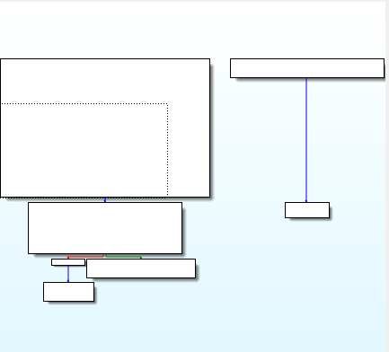

### hellojni:NDKC代码和伪C代码以及汇编代码分析

#### NDK C++

```C++
extern "C" JNIEXPORT jstring JNICALL Java_com_huruwo_armassembly2cpython_MainActivity_stringFromJNI(
        JNIEnv* env,
        jobject /* this */) {
    std::string hello = "Hello from C++";
    return env->NewStringUTF(hello.c_str());
}
```


#### IDA 伪C

```C++
int __fastcall Java_com_huruwo_armassembly2cpython_MainActivity_stringFromJNI(_JNIEnv *a1)
{
  int v2; // [sp+0h] [bp-38h]
  char *v3; // [sp+4h] [bp-34h]
  char v5[12]; // [sp+20h] [bp-18h] BYREF

  std::string::basic_string<decltype(nullptr)>();
  v3 = (char *)sub_8252(v5);
  v2 = _JNIEnv::NewStringUTF(a1, v3);
  std::string::~string(v5);
  return v2;
}
```

#### 对比分析

可以看到两个方法大有不同，因为在编译成二进制再回来语言的过程中新增也丢失了很多细节。

##### 返回: jstring 和 int 两种数据类型

本质上都是地址，用int没问题。jstring表明了数据类型，ida没有解析出来。

但是我们在动态调试里面拿到返回的int当成string解析就能出来。

**unidbg解析** 

```java
List<Object> list = new ArrayList<>(10);
list.add(vm.getJNIEnv());
list.add(0);
Number number = module.callFunction(emulator, 0x8188+1, list.toArray())[0];
System.out.println(number);
System.out.println(vm.getObject(number.intValue()).getValue().toString());
```
输出

```shell
717176949
Hello from C++
```

##### __fastcall 编译器新增

指示参数传递的入栈出栈问题

- 当参数个数多于一个时，按照什么顺序把参数压入堆栈
- 函数调用后，由谁来把堆栈恢复原装

- stdcall
- cdecl
- fastcall
>函数的第一个和第二个DWORD参数（或者尺寸更小的）通过ecx和edx传递，其他参数通过从右向左的顺序压栈
被调用函数清理堆栈
函数名修改规则同stdcall
- thiscall
- naked call

暂时了解fastcall即可

##### 参数JNIEnv 以及 jobject/*this*/被缺省了

- JNIEnv
JNIEnv类型实际上代表了Java环境，通过这个JNIEnv* 指针，就可以对Java端的代码进行操作。例如，创建Java类中的对象，调用Java对象的方法，获取Java对象中的属性等等。JNIEnv的指针会被JNI传入到本地方法的实现函数中来对Java端的代码进行操作。

- jobject
如果native方法不是static的话，这个obj就代表这个native方法的类实例
如果native方法是static的话，这个obj就代表这个native方法的类的class对象实例(static方法不需要类实例的，所以就代表这个类的class对象)


IDA确实直接缺省了第二个参数，因为实际上没有用到。

##### 逐行对比方法内部内容

由于之前的NDK写法过于简陋，现修改如下

```c++
std::string v5 = "Hello from C++";
const char *v3 =  v5.c_str();
jstring v2 = env->NewStringUTF(v3);
return v2;
```
对比IDA

```c++
int v2; // [sp+0h] [bp-38h]
char *v3; // [sp+4h] [bp-34h]
char v5[12]; // [sp+20h] [bp-18h] BYREF

std::string::basic_string<decltype(nullptr)>();
v3 = (char *)sub_8252(v5);
v2 = _JNIEnv::NewStringUTF(a1, v3);
std::string::~string(v5);
return v2;
```

###### 字符串赋值呢?

在伪C代码里面 看不到 v5的赋值信息

即使我只写一行

`std::string v5 = "Hello from C++";`

反编译过来也是

```c++
  char v1[12]; // [sp+10h] [bp-18h] BYREF
  std::string::basic_string<decltype(nullptr)>();
  std::string::~string(v1);
  return &_stack_chk_guard;
```

`std::string::basic_string<decltype(nullptr)>(); `这行也是编译器新增的 用于类型推断

实际上有用的是

`std::string::~string(v1);`

所以伪C代码不完全可信

##### c_str 和 sub_8252

可以推断出两个方法是一样的，但是IDA没有识别出这个方法来。

##### 剩下的没什么好看的


#### 汇编代码 

IDA的汇编代码加载了反编译的额外信息

我用unidbg trace了一份干净的code

`emulator.traceCode(module.base+0x8188,module.base+0x8265);`

```
  push {r7, lr}
  mov r7, sp
  sub sp, #0x30
  ldr r2, [pc, #0x68]
  add r2, pc
  ldr r2, [r2]
  ldr r2, [r2]
  str r2, [sp, #0x2c]
  str r0, [sp, #0x1c]
  str r1, [sp, #0x18]
  ldr r1, [pc, #0x5c]
  add r1, pc
  add r0, sp, #0x20
  str r0, [sp, #0xc]
  blx #0x40007c18
  push {r7, lr}
  mov r7, sp
  sub sp, #0x18
  str r0, [sp, #0x14]
  str r1, [sp, #0x10]
  ldr r0, [sp, #0x14]
  str r0, [sp, #0xc]
  blx #0x40007c54
  ldr r0, [sp, #0x10]
  str r0, [sp, #8]
  blx #0x40007c60
  ldr r1, [sp, #0xc]
  str r0, [sp, #4]
  mov r0, r1
  ldr r1, [sp, #8]
  ldr r2, [sp, #4]
  blx #0x40007c6c
  ldr r0, [sp, #0xc]
  add sp, #0x18
  pop {r7, pc}
  ldr r0, [sp, #0x1c]
  ldr r1, [sp, #0xc]
  str r0, [sp, #8]
  mov r0, r1
  bl #0x40008252
  push {r7, lr}
  mov r7, sp
  sub sp, #8
  str r0, [sp, #4]
  ldr r0, [sp, #4]
  bl #0x40008804
  add sp, #8
  pop {r7, pc}
  ldr r1, [sp, #8]
  str r0, [sp, #4]
  mov r0, r1
  ldr r1, [sp, #4]
  blx #0x40007c24
  push {r7, lr}
  mov r7, sp
  sub sp, #0x10
  str r0, [sp, #0xc]
  str r1, [sp, #8]
  ldr r0, [sp, #0xc]
  ldr r1, [r0]
  ldr.w r1, [r1, #0x29c]
  ldr r2, [sp, #8]
  str r1, [sp, #4]
  mov r1, r2
  ldr r2, [sp, #4]
  blx r2
JNIEnv->NewStringUTF("Hello from C++") was called from RX@0x4000824f[libnative-lib.so]0x824f
  add sp, #0x10
  pop {r7, pc}
  str r0, [sp]
  b #0x400081c4
  add r0, sp, #0x20
  blx #0x40007c30
  push {r7, lr}
  ldr r0, [pc, #0x34]
  add r0, pc
  ldr r0, [r0]
  ldr r0, [r0]
  ldr r1, [sp, #0x2c]
  cmp r0, r1
  bne #0x400081f2
  b #0x400081da
  ldr r0, [sp]
  add sp, #0x30
  pop {r7, pc}
```

作为对比可以看出IDA对这些数据做了什么

##### 流程图 Graph overview



##### 区块1:

