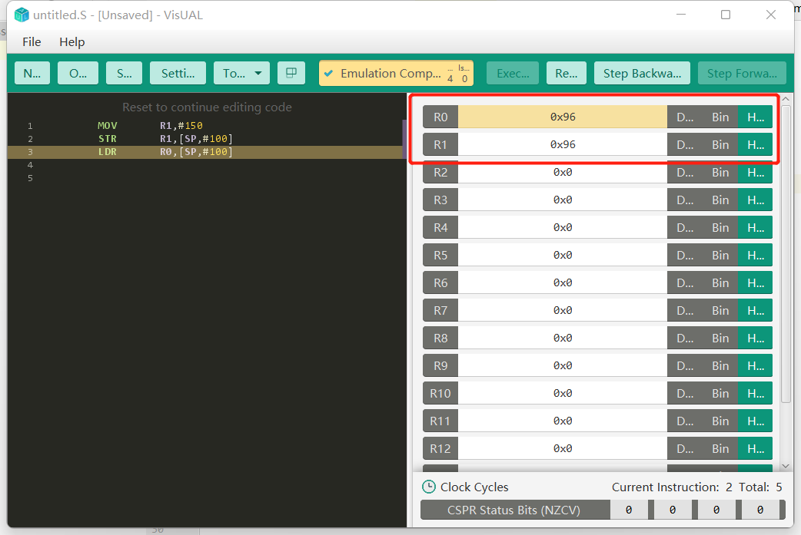

### sum_jni:NDKC代码和伪C代码以及汇编代码分析

#### NDK C++

```C++
extern "C" JNIEXPORT int JNICALL
Java_com_huruwo_armassembly2cpython_MainActivity_sumFromJNI(
        JNIEnv* env,
        jobject /* this */,int a,int b) {
    int c = a+b;
    return c;
}
```


#### IDA 伪C

```C++
int __fastcall Java_com_huruwo_armassembly2cpython_MainActivity_sumFromJNI(int a1, int a2, int a3, int a4)
{
  return a3 + a4;
}
```

#### 对比分析

可以看到两个方法大有不同，因为在编译成二进制再回来语言的过程中新增也丢失了很多细节。


##### 返回: int 数据类型

都是int没问题

##### __fastcall 编译器新增

指示参数传递的入栈出栈问题

- 当参数个数多于一个时，按照什么顺序把参数压入堆栈
- 函数调用后，由谁来把堆栈恢复原装

- stdcall
- cdecl
- fastcall
>函数的第一个和第二个DWORD参数（或者尺寸更小的）通过ecx和edx传递，其他参数通过从右向左的顺序压栈
被调用函数清理堆栈
函数名修改规则同stdcall
- thiscall
- naked call

暂时了解fastcall即可

##### 参数JNIEnv 以及 jobject 未被识别 

需要手动修复识别 导入头文件c.h 这里没用上可以不管

- JNIEnv
JNIEnv类型实际上代表了Java环境，通过这个JNIEnv* 指针，就可以对Java端的代码进行操作。例如，创建Java类中的对象，调用Java对象的方法，获取Java对象中的属性等等。JNIEnv的指针会被JNI传入到本地方法的实现函数中来对Java端的代码进行操作。

- jobject
如果native方法不是static的话，这个obj就代表这个native方法的类实例
如果native方法是static的话，这个obj就代表这个native方法的类的class对象实例(static方法不需要类实例的，所以就代表这个类的class对象)


##### 逐行对比方法内部内容


NDK

```C++
extern "C" JNIEXPORT int JNICALL
Java_com_huruwo_armassembly2cpython_MainActivity_sumFromJNI(
        JNIEnv* env,
        jobject /* this */,int a,int b) {
    int c = a+b;
    return c;
}
```

IDA

```C++
int __fastcall Java_com_huruwo_armassembly2cpython_MainActivity_sumFromJNI(int a1, int a2, int a3, int a4)
{
  return a3 + a4;
}
```

看起来一致 IDA对这个函数的还原非常高

#### 汇编代码 

##### 针对函数:sumFromJNI 汇编代码

IDA的汇编代码加载了反编译的额外信息
作为对比可以看出IDA对这些数据做了什么

```
SUB             SP, SP, #0x14
SP = SP-14

STR             R0, [SP,#0x14+var_4]
STR             R1, [SP,#0x14+var_8]

存储R0 R1 的值

STR             R2, [SP,#0x14+var_C]
STR             R3, [SP,#0x14+var_10]


LDR             R0, [SP,#0x14+var_C]

R2 到 R0

LDR             R1, [SP,#0x14+var_10]

R3 到 R1


ADD             R0, R1

R0 = R1+R0

STR             R0, [SP,#0x14+var_14]
LDR             R0, [SP,#0x14+var_14]

这个操作等同没操作

ADD             SP, SP, #0x14

SP = SP+#14 恢复SP的值

BX              LR

返回 LR 即跳转到lr中存放的地址处

```
SP = SP-14

STR 寄存器数据到储存器 后面是存储器的地址
寻址方式 基址变址:[SP+立即数]

LDR 存储器数据读到寄存器 后面是存储器的地址
寻址方式 基址变址:[SP+立即数]

ADD  R0 = R1+R0

STR LDR 操作同一个地址

STR R0数据到存储器
LDR 存储器数据回到R0

BX LR 即跳转到lr中存放的地址处 用于程序返回 返回值在R0中

演示一遍


可以看到R1的值转移到了R0

#### 整体解析

SP(R13)栈寄存器栈顶指针

ARM的栈是自减栈，栈是向下生长的，也就是栈底处于高地址处，栈顶处于低地址处

修改栈顶 减14

寻找方式都是基于SP的寻址

而且都加上了14也就是回到了原来的SP位置

```
var_14= -0x14
var_10= -0x10
var_C= -0xC
var_8= -8
var_4= -4
```
最大的寻址 偏移的位置正好 14

先STR R0 R1 R2 R3 压进栈入参

LDR 取出参数值赋值给 R0 R1

ADD 进行操作 返回R0

恢复 SP 也就是函数结束 

BX 函数返回

