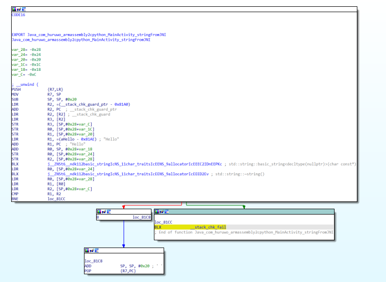

### string_jni:NDKC代码和伪C代码以及汇编代码分析

#### NDK代码 与 IDA 伪C代码

##### NDK代码

```c++
extern "C" JNIEXPORT void JNICALL
Java_com_huruwo_armassembly2cpython_MainActivity_stringFromJNI(
        JNIEnv* env,
        jobject /* this */) {
    std::string s = "Hello from C++";
}
```
##### IDA 伪C代码

```C++
void *Java_com_huruwo_armassembly2cpython_MainActivity_stringFromJNI()
{
  char v1[12]; // [sp+10h] [bp-18h] BYREF

  std::string::basic_string<decltype(nullptr)>();
  std::string::~string(v1);
  return &_stack_chk_guard;
}
```

比较来看 伪C代码还原的不够彻底

- 没有关于字符串的信息 不知道字符串的赋值
- 后面的 `[sp+10h] [bp-18h] BYREF` 用于截取一段地址存放数据    
Hello from C++                              char v1[12]; // [sp+10h] [bp-18h] BYREF
Hello from C+++++++++++++++++++++++++       char v1[12]; // [sp+10h] [bp-18h] BYREF

新建char v1[12] 数组 

字符串长度和数组大小 编译器会给数组分配12个单元，每个单元的数据类型为字符(不管多长都分配12 这很奇怪)

SP栈顶 BP  SP+10h           

ByVal是值传递；ByRef是地址传递

- `std::string::basic_string<decltype(nullptr)>();` 类模板 basic_string 存储并操纵作为非数组平凡标准布局类型的仿 char 对象序列。
- `std::string::~string(v1); ` string构造方法 从 v1 char数组 里面构造字符串
- `__stack_chk_guard` 是栈保护区域 (stack canary)的初始值 return &_stack_chk_guard 就是返回 stack_chk_guard存储单元的地址  这是编译器的 和函数本身无关
- `void` 没有返回是正确的


### 汇编代码分析

#### IDA流程视图

总体的流程



##### 先分析下面的三个小块

1.跳转loc_81c8
2.loc_81c8 进行两个操作  恢复SP栈顶 POP出栈 R7和LR寄存器
3.栈检测失败跳转的 loc_81cc 跳转 __stack_chk_fail 函数

#### 核心的区块