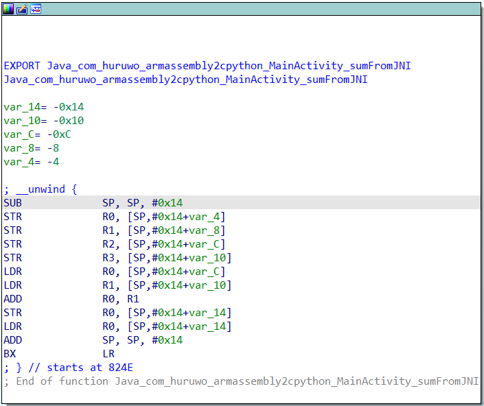
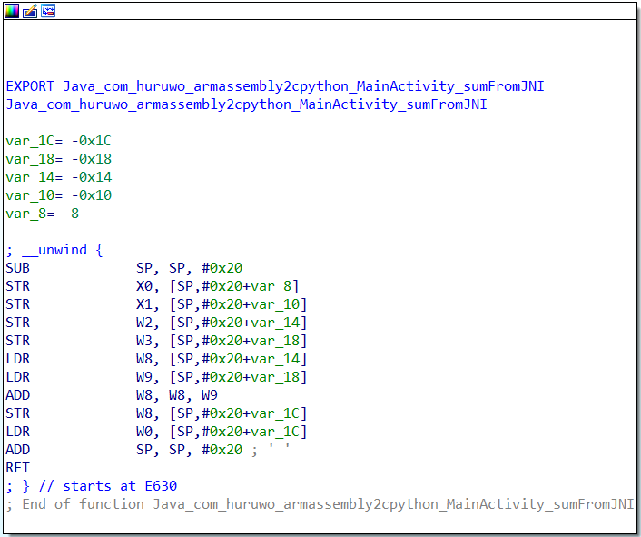

### ARM32和ARM64

#### 定义

- ARM是RISC（精简指令集）处理器，不同于x86指令集（CISC,复杂指令集）。
- Arm32位是ARMV7架构，32位的，对应处理器为Cortex-A15等； iphone5以前均是32位的；
需要注意：ARMV7-A和ARMV7-R系列支持neon指令集，ARMv7-M系列不支持neon指令集。
- ARM64位采用ARMv8架构，64位操作长度，对应处理器有Cortex-A53、Cortex-A57、Cortex-A73、iphones的A7和A8等，苹果手机从iphone 5s开始使用64位的处理器。

ARM64是未来趋势，ARM32最终一定会被淘汰。所以学习ARM64才是未来趋势，分析应用的SO也应该以64为架构优先。

#### Android SO

配置中

```gradle
externalNativeBuild {
            cmake {
                cppFlags ""
                abiFilters "armeabi-v7a" , "arm64-v8a"
            }
        }
```

arm64-v8a就是指定编译64位的so文件

对应的文件夹也是

- armeabi-v7a
- arm64-v8a

强行使用IDA打开64位的so 只会提示请使用64去打开

#### 反汇编代码对比

- ARM32


- ARM64


可以看到指令上有非常大的不同 即使是简单的一个函数

栈分配深度就不同


### 分析

ARM32目前还是主流支持的架构，ARM64向下兼容ARM32应用，只是损失性能。

学习ARM32，资料多文档全。非常多的教程都是基于ARM32汇编分析。

而ARM64是趋势也需要后期转入学习。